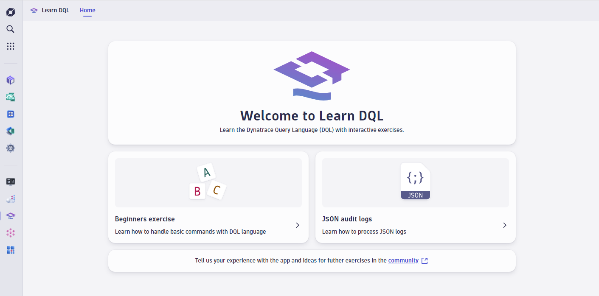
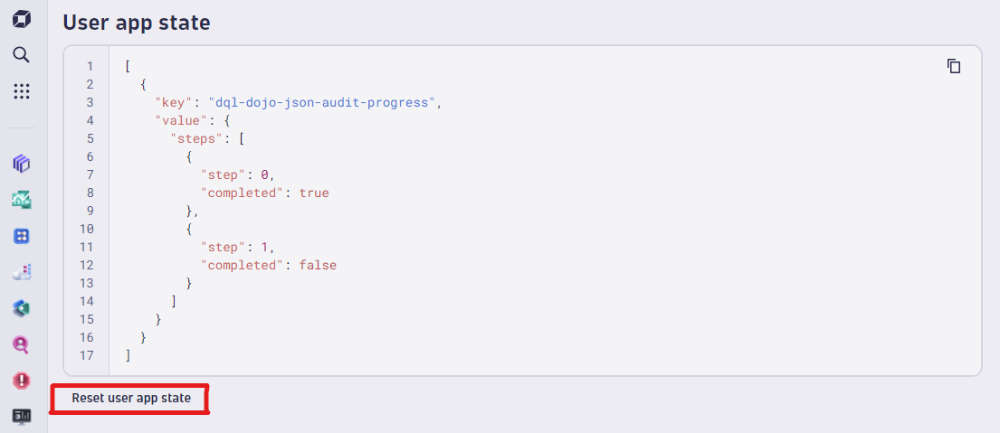

## Hands-On Exercise 1 - DQL Basics

In this section, you will access the shared Dynatrace environment and review the basic concepts of DQL, including:
- Loading data
- Filtering
- Selecting fields
- Parsing
- Sorting
- Aggregating

 
 

---
### Step 1

Navigate to the **Learn DQL** application in the Dynatrace environment provided for this HOT session:  

**[https://zcy16892.apps.dynatrace.com/ui/apps/dynatrace.learndql/](https://zcy16892.apps.dynatrace.com/ui/apps/dynatrace.learndql/)**

 
 

---
### Step 2

Complete the **Beginners Exercises** 

 

**Note:**
- The queries in this exercise build upon the previous query.  Don't start from stratch, just continue to add to the query you're building.

- Read the prompt closely, the matcher to check your success is very specific.

- Use the provided links to documentation if you get stuck.

- If you need to reset your progress on the beginners exercises:
    - Navigate to **[https://zcy16892.apps.dynatrace.com/ui/apps/dynatrace.learndql/debug](https://zcy16892.apps.dynatrace.com/ui/apps/dynatrace.learndql/debug)**
    - Click **Reset user app state**

