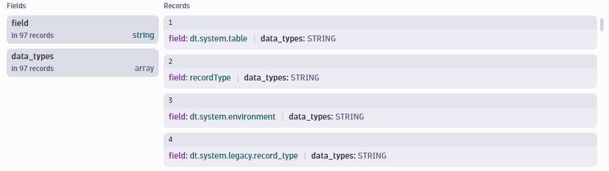
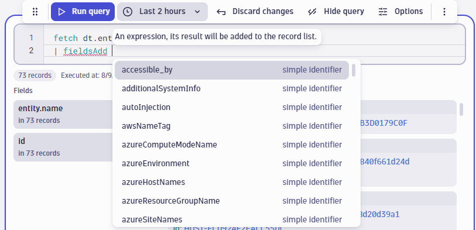
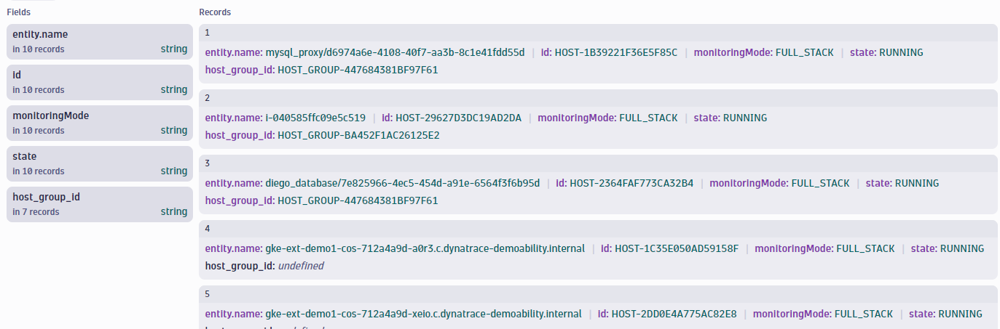
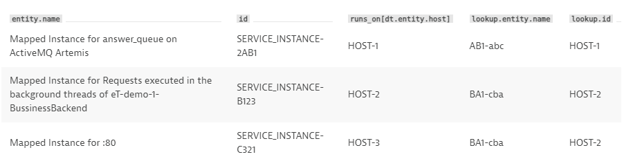
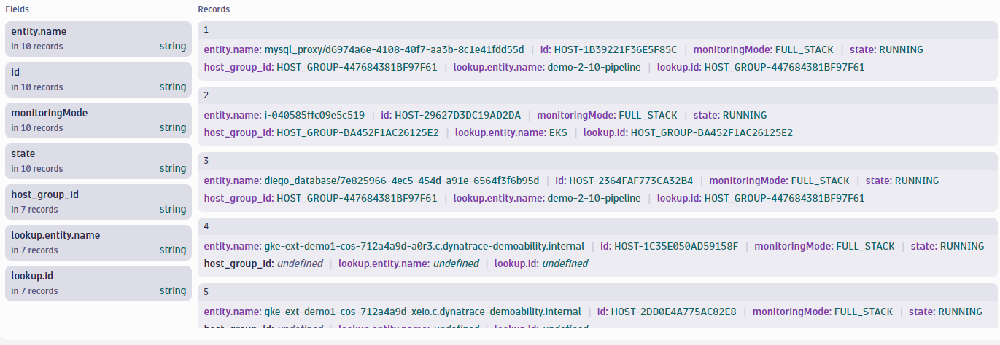
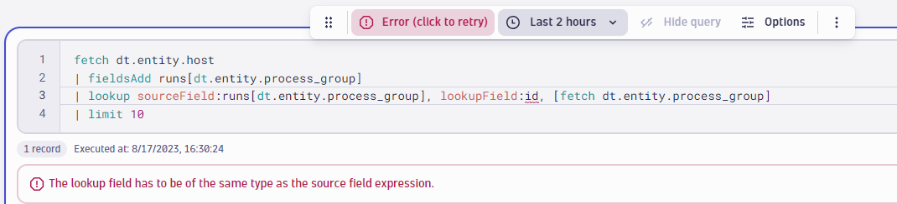

## Hands-On Exercise 2 - Querying Entities

In this section, you will practice querying entities and relationships with DQL in a Notebook.

For these exercises, you will use the **[Dynatrace demo environment](https://guu84124.apps.dynatrace.com/ui/apps/dynatrace.notebooks/notebooks)**.  Navigate to that environment and create a new notebook.

---

### Step 1: Fetch a List of Hosts

We will begin by querying a list of hosts.

Add a new section to your notebook and choose "Query Grail".


#### Write and execute a query to obtain a list of hosts. Limit to 10 results.

<br>


<H4> Expected Result:

<br>


<H4><details>
<summary>Click to Reveal Solution</summary>
<br>
<br>

```
fetch dt.entity.host
| limit 10
```
</details></H4>

<br>
<br>

---

### Step 2: Find Potential Fields to Add

Notice that by default, the only data returned for each host is the entity name and entity id.  To write a useful entity query, you will need to use additional fields.  To do that, you need to know what fields are available.

You can use the **describe** command to query information about the schema of a datatype.  This command will return the fields associated with a datatype.

#### Add a <u>new section</u> to your notebook and use the describe command to list the fields associated with the dt.entity.host datatype.


<H4> Expected Result:

<br>




<H4><details>
<summary>Click to Reveal Solution</summary>
<br>

```
describe dt.entity.host
```

</details></H4>

<br>
<br>

---

### Step 3: Add Additional Fields

Now that you know what fields are available to query for hosts, you can add additional fields to the output by using the **fieldsAdd** command.

Note: When using the **fieldsAdd** command, you will see a list of suggested fields you can add to the results.  

<!--  -->

#### Return to your <u>original **fetch** query</u> and add monitoring mode and state to the results.


<H4>Expected Result:

<br>


<H4><details>
<summary>Click to Reveal Solution</summary>

```
fetch dt.entity.host
| fieldsAdd monitoringMode, state
| limit 10
```


</details></H4>
<br>
<br>

---

### Step 4: Add Related Entities

Entity relationships are available to add as fields in a DQL query.  This includes relationships such as:
- which hosts belong to a host group
- which processes run on a host
- which services run on a process group

and many more.


#### Using a relationship function, add the host group to which each host belongs to your query

(**Hint**: See the [Relationship Mapping Table](https://www.dynatrace.com/support/help/shortlink/grail-querying-monitored-entities#relationship-mapping-table) for information on the relationship functions available in DQL.)
<br>

<H4>Expected Result:

<br>




<H4><details>
<summary>Click to Expand Solution</summary>

```
fetch dt.entity.host
| fieldsAdd monitoringMode, state, host_group_id = instance_of[dt.entity.host_group]
| limit 10
```


</details></H4>
<br>
<br>

---

### Step 5: Lookup Host Group Name

In the last step, you added the entity id of the host group related to each host.  However, it would be more user friendly to have the names of these entities included in the results.

The **lookup** command can be used to join data from related entities.

Reference: [Lookup Command Documentation](https://www.dynatrace.com/support/help/shortlink/dql-commands#lookup)

<br>

For example, the following query fetches a list of service instances, the hosts they run on, and then the names of those hosts using the **lookup** command.

Query:
```
fetch dt.entity.service_instance
| fieldsAdd host_id = runs_on[dt.entity.host]
| lookup sourceField:host_id, lookupField:id, [ fetch dt.entity.host ]
```
Result:


<br>

#### Using the lookup command, add the name of the host group to the results.

- **Note:** it is a best practice to give fields readable names using **alias** or **=**.  Which also makes it easier to reference those fields with other commands, like **lookup**.

<br>

<H4>Expected Result:

<br>




<H4><details>
<summary>Click to Expand Solution</summary>

```
fetch dt.entity.host
| fieldsAdd monitoringMode, state, host_group_id = instance_of[dt.entity.host_group]
| lookup sourceField: host_group_id, lookupField: id, [fetch dt.entity.host_group]
| limit 10
```


</details></H4>
<br>
<br>

**Note:** 

The **lookup** command will only work if the sourceField value is a <u>single ID</u>.  If the sourceField value is a list, such as a list of process groups, the query will return an error.



In this case, you would first need to use the **expand** command to retrieve individual records per process group.  This is not covered in this exercise.  To learn more, see [documentation](https://www.dynatrace.com/support/help/shortlink/grail-querying-monitored-entities#expand-relationships).

<br>
<br>