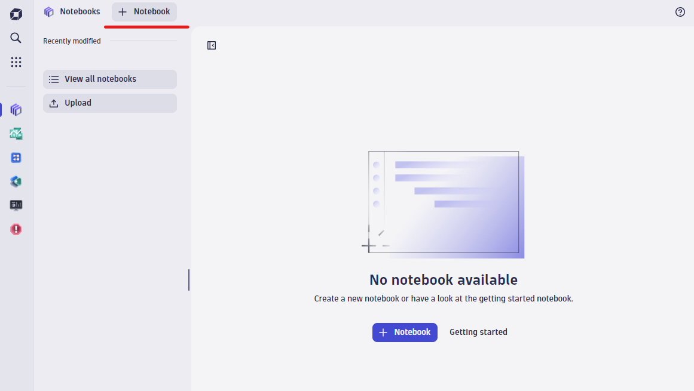

## Notebooks

Notebooks are the new home for data exploration in Dynatrace.  Notebooks allow you to create powerful, data-driven documents for custom analysis.

For the remaining exercises, you will execute queries within your own custom notebooks.

Reference:
- [Notebooks - Dynatrace Documentation](https://docs.dynatrace.com/docs/shortlink/notebooks)

### Creating a New Notebook

To create a new notebook, locate the Notebooks application in the main menu and click to open.

Click the **"+ Notebook"** button to create a new notebook.

### Notebook Sections

Notebooks can consist of multiple sections, including:
- **Query**: Displays data queried from Grail.
- **Code**: Displays data returned by custom code executed within the notebook.
- **Markdown**: Displays static content edited in markdown.

For Query and Code sections, you can choose from a list of available snippets to start with a template.  

For example: query logs aggregated by log level, or top 10 hosts by cpu usage.

### Additional Notebook Features

In addition to simple queries and custom code, Notebooks provide several other useful features, including:
- A variety of visualization options to control how your data is displayed.
- The **[DPL architect](https://docs.dynatrace.com/docs/shortlink/dpl-architect)** to assist with parsing data from records.
- **[Forecast analysis](https://docs.dynatrace.com/docs/shortlink/davis-ai-forecast)** based on Davis AI.

We will explore some of these features in the following exercises.
