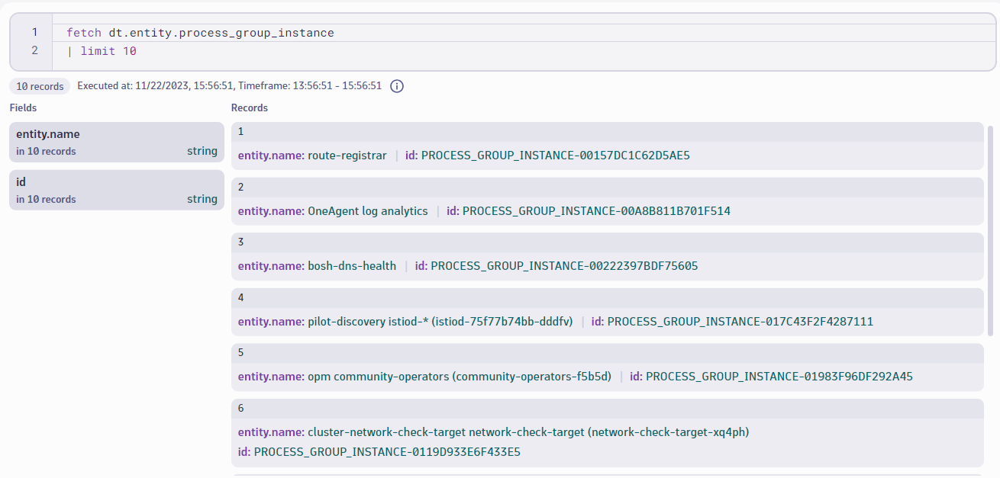
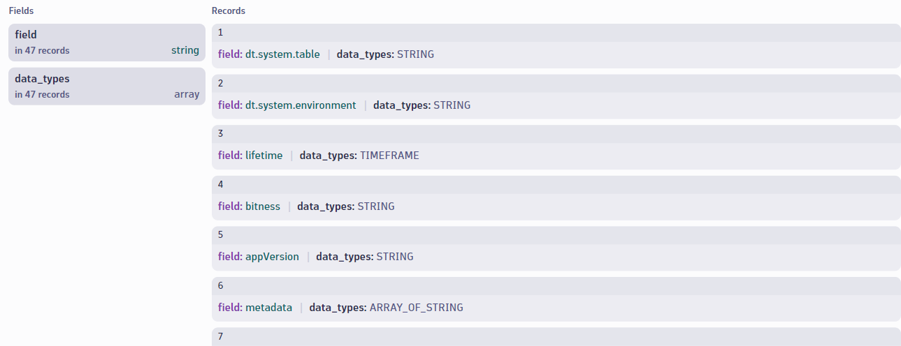
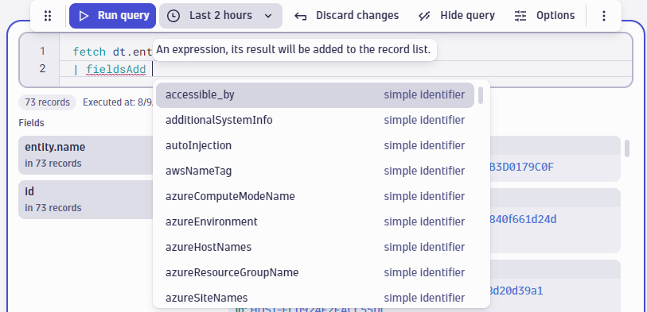
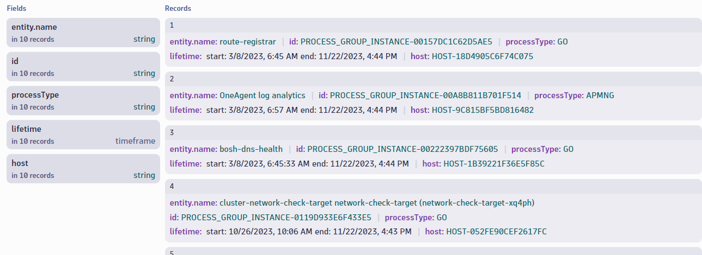
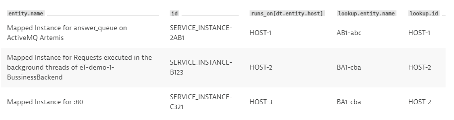
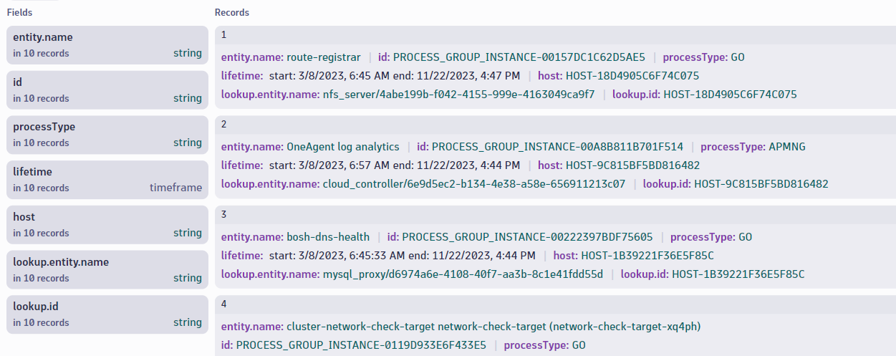
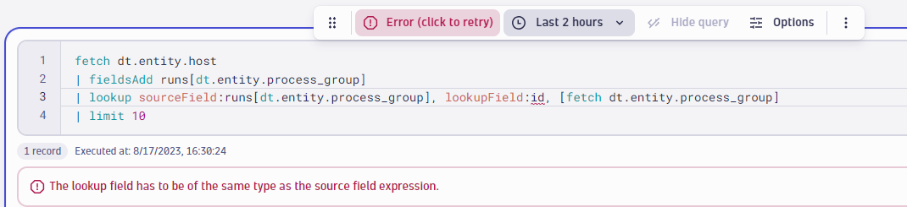

## Querying Entities with DQL


In this section, you will practice querying entities and relationships with DQL in a Notebook.

In the **[Training Environment](https://zex57197.apps.dynatrace.com/ui/apps/dynatrace.notebooks/notebooks)**, create a new notebook named "Entity Exercises".


---

### Step 1: Fetch a List of Process Group Instances

We will begin by querying a list of process group instances.  A process group instance is an individual instance of a process which runs on a single host.

Add a new section to your notebook and choose "Query Grail".


#### <u>Objective</u>: Write and execute a query to obtain a list of process group instances. Limit to 10 results.

<br>

**HINT**: If you're unsure what data object to use in your fetch statement, run the following query to view a list of available entity types:

    fetch dt.system.data_objects
    | filter contains(name, "dt.entity")
<br>

<H4> Expected Result:

<br>



<H4><details>
<summary>Click to Reveal Solution</summary>
<br>
<br>

```
fetch dt.entity.process_group_instance
| limit 10
```
</details></H4>

<br>
<br>

---

### Step 2: Find Potential Fields to Add

Notice that by default, the only data returned for each process group instance is the entity name and entity id.  To write a useful entity query, you will need to use additional fields.  To do that, you need to know what fields are available.

You can use the **describe** command to query information about the schema of a data object.  This command will return the fields associated with a data object.

#### Add a <u>new section</u> to your notebook and use the describe command to list the fields associated with the dt.entity.process_group_instance data object.


<H4> Expected Result:

<br>




<H4><details>
<summary>Click to Reveal Solution</summary>
<br>

```
describe dt.entity.process_group_instance
```

</details></H4>

<br>
<br>

---

### Step 3: Add Additional Fields

Now that you know what fields are available to query for process group instances, you can add additional fields to the output by using the **fieldsAdd** command.

Note: When using the **fieldsAdd** command, you will see a list of suggested fields you can add to the results.  

<!--  -->

#### Return to your <u>original **fetch** query</u> and add processType and lifetime to the results.


<H4>Expected Result:

<br>


<H4><details>
<summary>Click to Reveal Solution</summary>

```
fetch dt.entity.process_group_instance
| fieldsAdd processType, lifetime
| limit 10
```


</details></H4>
<br>
<br>

---

### Step 4: Add Related Entities

Entity relationships are available to add as fields in a DQL query.  This includes relationships such as:
- which hosts belong to a host group
- which processes run on a host
- which services run on a process group

and many more.


#### Using a relationship function, find the host that this process runs on and add it to the results of your query.

(**Hint**: See the [Relationship Mapping Table](https://www.dynatrace.com/support/help/shortlink/grail-querying-monitored-entities#relationship-mapping-table) for information on the relationship functions available in DQL.)
<br>

<H4>Expected Result:

<br>




<H4><details>
<summary>Click to Expand Solution</summary>

```
fetch dt.entity.process_group_instance
| fieldsAdd processType, lifetime, host = belongs_to[dt.entity.host]
| limit 10
```


</details></H4>
<br>
<br>

---

### Step 5: Lookup Host Name

In the last step, you added the entity id of the host that this process runs on.  However, it would be more user friendly to have the names of these entities included in the results.

The **lookup** command can be used to join data from related entities.

**Reference: [Lookup Command Documentation](https://www.dynatrace.com/support/help/shortlink/dql-commands#lookup)**

<br>

For example, the following query fetches a list of service instances, the hosts they run on, and then the names of those hosts using the **lookup** command.

Query:
```
fetch dt.entity.service_instance
| fieldsAdd host_id = runs_on[dt.entity.host]
| lookup sourceField:host_id, lookupField:id, [ fetch dt.entity.host ]
```
Result:


<br>

#### Using the lookup command, add the name of the host group to the results.

- **Note:** it is a best practice to give fields readable names using **alias** or **=**.  Which also makes it easier to reference those fields with other commands, like **lookup**.

<br>

<H4>Expected Result:

<br>




<H4><details>
<summary>Click to Expand Solution</summary>

```
fetch dt.entity.process_group_instance
| fieldsAdd processType, lifetime, host = belongs_to[dt.entity.host]
| lookup [fetch dt.entity.host], sourceField:host, lookupField:id
| limit 10
```


</details></H4>
<br>
<br>

**Note:** 

The **lookup** command will only work if the sourceField value is a <u>single ID</u>.  If the sourceField value is a list, such as a list of process groups that run on a single host, the query will return an error.



In this case, you would first need to use the **expand** command to retrieve individual records per process group.  This is not covered in this exercise.  To learn more, see [documentation](https://www.dynatrace.com/support/help/shortlink/grail-querying-monitored-entities#expand-relationships).

<br>
<br>