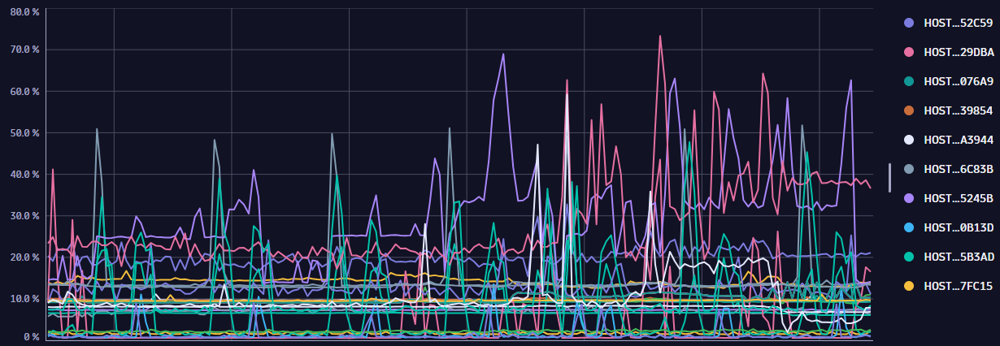

## Querying Metrics with DQL

In this section, you will practice querying metrics and charing using the `timeseries` command with DQL in a Notebook.

In the **[Training Environment](https://zex57197.apps.dynatrace.com/ui/apps/dynatrace.notebooks/notebooks)**, create a new notebook named "Timeseries Exercises".

---

The `timeseries` command is a starting command of DQL. It combines loading, filtering and aggregating metrics data into a time series output.

```
timeseries
  [column =] aggregation [, default:] [, [column =] aggregation [, default:], ...]
  [, by:] [, filter:]
  [, interval: | bins:]
  [, from:] [, to:] [, timeframe:]
```

**Simple Example**

```
timeseries avg(dt.host.cpu.usage)
```

**Advanced Example**

```
timeseries min_cpu=min(dt.host.cpu.usage), max(dt.host.cpu.usage), default:99.9, by:dt.entity.host, filter:in(dt.entity.host, "HOST-1", "HOST-2"), interval:1h, from:-7d

```

### Reference

- [timeseries Command](https://www.dynatrace.com/support/help/shortlink/dql-commands#timeseries)
- [Grail Metrics](https://www.dynatrace.com/support/help/observe-and-explore/metrics/built-in-metrics-on-grail)

### Exercise 1

Using the timeseries command, create a chart within a notebook or dashboard that displays the avg cpu percentage split by host. The resulting chart should be similar to the image below: 

_Note_ - the number of hosts in the training environment may be less than shown below.



<H3><details>
    <summary>Click to Expand Solution</summary>

```
timeseries avg(dt.host.cpu.usage), by:{dt.entity.host}
```

</H3></details>

### Exercise 2

Using the timeseries command create a chart that displays container cpu usage percent filtered by containers containing the name `cartservice`


<H3><details>
    <summary>Click to Expand Solution</summary>

```
timeseries avg(dt.containers.cpu.usage_percent), by:{Container}, filter: in(Container, "cartservice")
```

</H3></details>
