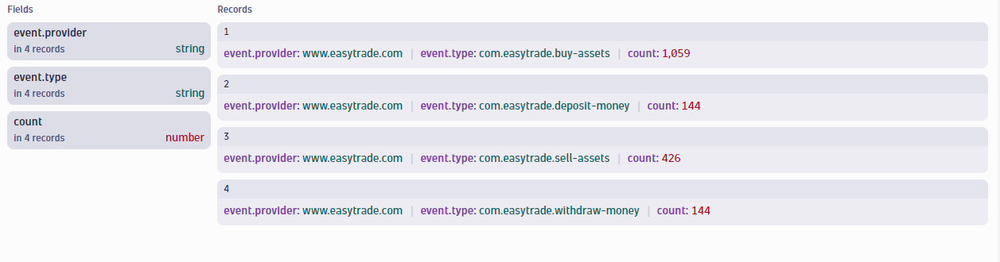
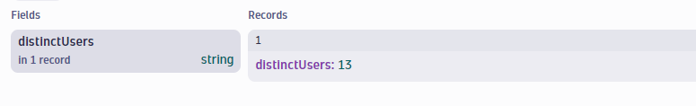
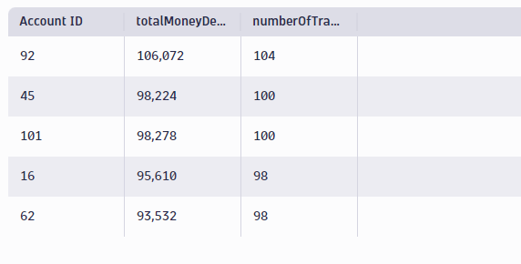

## Querying Business Events with DQL

In this section, you will practice querying business events with DQL in a Notebook.

In the **[Training Environment](https://zex57197.apps.dynatrace.com/ui/apps/dynatrace.notebooks/notebooks)**, create a new notebook named "Bizevent Exercises".

---

### Step 1: Find the Existing Business Events

Before you begin to analyze business event data with DQL, you need to understand what business events are currently configured in your environment.

Three business events have been preconfigured in this environment for the EasyTrade application.  

#### Create a new notebook and write a query that does the following:
- Lists all currently configured business events for the EasyTrade app.
- Counts the number of occurrences of each in the last two hours.

**Hint:** There are two mandatory data fields that all business events must have: _event.provider_, and _event.type_.  

**Expected Result:**
<br>




<H4><details>
    <summary>Click to Expand Solution</summary>

```
	fetch bizevents
	| filter event.provider == "www.easytrade.com"
	| summarize count = count(), by:{event.provider, event.type}
```

</details></H4>

<br>
<br>

---

### Step 2: Find the Number of Depositors

Now that we know what business events exist in this environment, we can begin using this data to perform business analysis. 

Business events don't just represent the occurrence of an event.  Business event objects can also contain extracted data which provides additional information about the event.

One of the business events, _com.easytrade.deposit-money_, represents a user using the application to deposit money.  This event is configured to extract additional information including the user's account id (**accountId**) and the amount of money deposited (**amount**).

#### Write a query that will provide the number of <u>unique users</u> who have deposited money in the last 2 hours.

(**Hint:** Check the documentation for a DQL function that can provide a count of unique values: https://www.dynatrace.com/support/help/shortlink/dql-functions)

**Expected Result:**

<br>




<H4><details>
    <summary>Click to Expand Solution</summary>

```
	fetch bizevents
	| filter event.type == "com.easytrade.deposit-money"
    | summarize distinctUsers = countDistinct(accountId)
```


</details></H4>


<br>
<br>

---


### Step 3: Find the Top Depositors

There are many ways the Summarize command can be used to manipulate the captured data to perform analysis.

#### Using the summarize command and the available fields (accountId and amount), write a query to provide the following:
- The total amount of money deposited by each user.
- The total number of deposit transactions initiated by each user.
- Order the list to show the users who have deposited the most amount of money first.
- Limit to the top 5 depositors

**Expected Result:**

<br>



<H4><details>
    <summary>Click to Expand Solution</summary>

```
    fetch bizevents
    | filter event.type == "com.easytrade.deposit-money"
    | summarize {totalMoneyDeposited = sum(amount), numberOfTransactions = count()}, by:{`accountId`}
    | sort totalMoneyDeposited desc
    | limit 5
```

</details></H4>