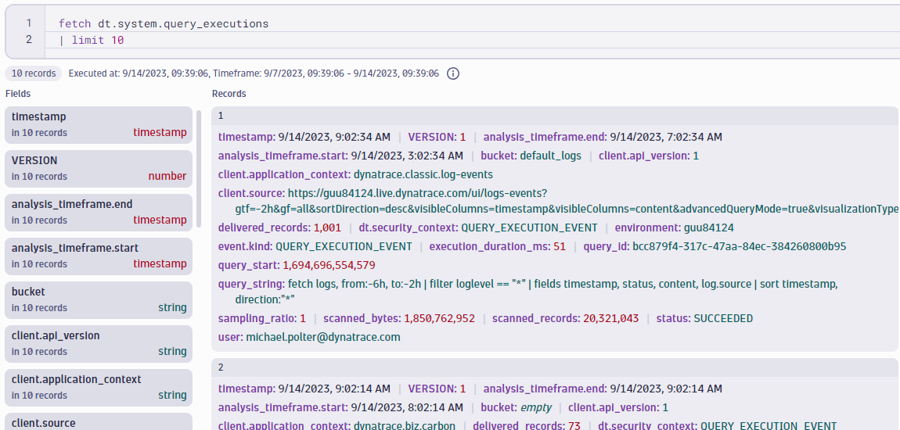
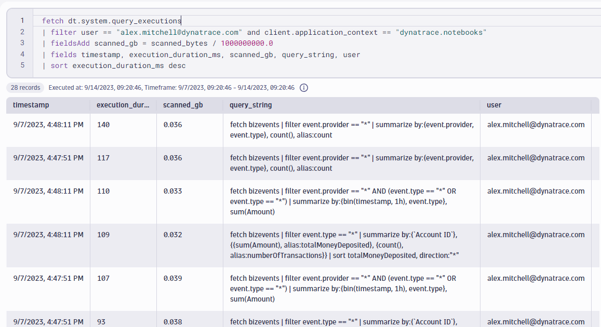

## Optimization and Cost Control in DQL

The consumption model for both logs and events on DPS is based on three dimensions:
- **Ingest & Process**: per gibibyte (GiB)
- **Retain**: per gibibyte-day (GiB-day)
- **Query**: per gibibyte scanned (GiB scanned)

Query data usage occurs during any execution of a query: on the Logs & Events page, on a Dashboard, in a Notebook, etc.  For this reason, it's important to implement best practices when writing queries and be conscious of how often you are executing complex queries.

To assist with this, Dynatrace stores data on all query executions in Grail, accessible via the **dt.system.query_executions** data object.

In this hands-on exercise, you will practice writing a cost-tracking query.

In the **[Training Environment](https://zex57197.apps.dynatrace.com/ui/apps/dynatrace.notebooks/notebooks)**, create a new notebook named "Optimization Exercises".


---


### Step 1: Fetch a Sample of Query Execution Data

To understand what fields are available in a query_executions record, you can start by querying a sample of the data.  

_**Note**: A limit should be used as query\_executions is a large dataset and we are only looking for a sample._

**Run the following query and review the results:**
```
fetch dt.system.query_executions
| limit 10
```

**Questions to think about:**
- Is there more than one way to think about query cost?
- Which fields give me information about the cost of this query?  
- What fields could I use to find where this query was run?

<br>

**Expected Results:**



<br>
<br>

### Step 2: Write a Query to Provide Practical Results

Now that you know what fields are included in the query_executions data, you can write specific queries to find costly queries, monitor the consumption of popular dashboards, and more.

In this exercise, you will write a query to fetch **your own** queries run in notebooks in this environment and their relevant cost metrics: execution duration and scanned GB.

<b>
Paste the following query into your notebook and make the following changes:

- Enter your email to filter to your queries
- Choose whether to sort results by scanned GB or execution duration
- Choose the table visualization
</b>


```
fetch dt.system.query_executions
| filter user == "[YOUR EMAIL HERE]" and client.application_context == "dynatrace.notebooks"
| fieldsAdd scanned_gb = scanned_bytes / 1000000000.0
| fields timestamp, execution_duration_ms, scanned_gb, query_string, user
| sort [INSERT METRIC HERE] desc
```

**Review the results**

<br>


_**Note:** query\_executions does not provide a scanned GB metric, but you can return this value by converting from bytes using a mathematical operation._

<br>


**Expected Results:**




