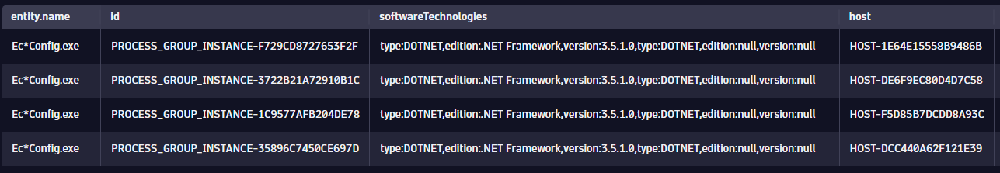
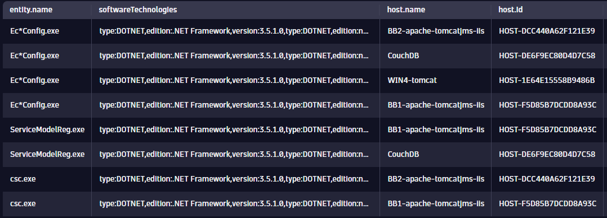

## Hands-On Exercise 4 - Entity Queries in Practice

In this section, you will work through a practical use case using entity queries in DQL. The familiar Dynatrace entity model is available directly in DQL queries, giving you direct access to entity relationships and properties. 

---

### Step 1: Filter entities based on specific criteria
One of the things we can use DQL and entities is to provide as much insight and visibility into processes potentially affected by known vulnerabilities. For example, there was situation where a specific Windows patch and .NET Framework 3.5 resulted in a vulnerability.

For these kinds of situations, the entity information available in GRAIL gives us the means to look for the Process Group Instances (PGIs) that could potentially be affected by.

We will begin by querying for a list of PGIs based on their technology type. In a new Notebook, add a new section and choose "Query Grail".

As we reviewed in the DQL HOT session 1, describe command is a powerful command that provides us with a comprehensive list of available fields for the referenced entity type. This is the first thing that we need to do, from the Process Group Instance entity type, which could be some of the potential fields available that can give us information about the technology they use.

#### Write and execute a query to obtain a list of PGIs where technology is .NET and the version contains '3.5'. Make sure to add the 'softwareTechnologies' column to confirm that the .NET version 3.5 is being met. Here is an example of a result we are looking for.


<H4><details>
<summary>Click to Expand Solution</summary>
<br>

```
fetch dt.entity.process_group_instance
| filter processType == "DOTNET" and contains(toString(softwareTechnologies), "3.5")
| fieldsAdd softwareTechnologies
```
</details></H4>

---

### Step 2: Add additional context information regarding these applications
As you can see, that simple query is giving us the list of potentially affected processes by a known vulnerability. With this we can start adding contextual information, such as which hosts the application processes are running on.
In this step, referencing the output of the describe command we want to fetch "Relationship" type of fields to understand which is the field we can use to understand which is the underlying host where the filtered entities are running on.

#### Update the query to add information about the underlying host.



(**Hint**: You can use the **belongs_to** entity relationship field that provides the underlying host information. In order to display the ID, you will need to process the contents of this field. Check out [String functions](https://www.dynatrace.com/support/help/platform/grail/dynatrace-query-language/functions#dql-string-functions), in this case **toString** and **substring**)

<H4><details>
<summary>Click to Expand Solution</summary>
<br>

```
fetch dt.entity.process_group_instance
| filter processType == "DOTNET" and contains(toString(softwareTechnologies), "3.5")
| fieldsAdd softwareTechnologies
| fieldsAdd belongs = toString(belongs_to)
| fieldsAdd host = substring(belongs, from:indexOf(belongs, ":")+2, to:lastIndexOf(belongs, "\""))
| fieldsRemove belongs
```
</details></H4>
---

---

### Step 3: Add the underlying host name
Now that we have extracted the underlying host entity ID, we can use this information to look up the host display name. With the host ID we got from the previous step, we need to obtain the entity name related to such ID. Lookup command is the one we can use to join information from different entity types using a common parameter, in this case the referenced host ID.

#### Update the query to add the underlying host name.



(**Hint**: We will need to use the lookup command (Refer to the DQL HOT 1 Entities session). Check out [lookup command documentation](https://www.dynatrace.com/support/help/platform/grail/dynatrace-query-language/commands#lookup))

<H4><details>
<summary>Click to Expand Solution</summary>
<br>

```
fetch dt.entity.process_group_instance
| filter processType == "DOTNET" and contains(toString(softwareTechnologies), "3.5")
| fieldsAdd softwareTechnologies
| fieldsAdd belongs = toString(belongs_to)
| fieldsAdd host = substring(belongs, from:indexOf(belongs, ":")+2, to:lastIndexOf(belongs, "\""))
| lookup [fetch dt.entity.host 
	| filter osType == "WINDOWS" 
	| fields name=entity.name, id ], sourceField:host, lookupField:id, prefix:"host."
| fields entity.name, softwareTechnologies, host.name, host.id
```
</details></H4>
---

