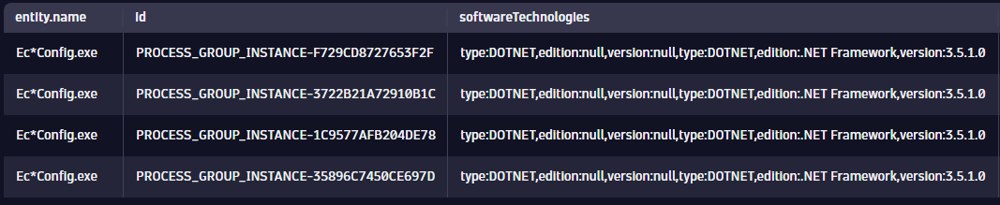

## Practical Exercises

In this section, we will apply the concepts you have learned about DQL in your own environment.

In a **Dynatrace environment of your choice**, create a new notebook named "DQL Exercises".  

*Note: If you do not have access to a Dynatrace environment with log and entity data within your organization, or do not have permissions to run DQL queries in that environment, you may continue to use the **[Training Environment](https://zex57197.apps.dynatrace.com/ui/apps/dynatrace.notebooks/notebooks)**.*

### Exercise 1: Logs in Practice

All log records will have a status field. This is commonly "INFO", "WARN", "ERROR", etc.. 

<u>**Objective:**</u> Build a DQL query that calculates the percentage of ERROR records vs the total number of records.

HINT: No filters are required, use the countIf() and toDouble() functions. Be sure to create variables to refence. Use FieldsAdd to produce the percentage.

<H4><details>
<summary>Solution</summary>

```
fetch logs
| summarize total = count(), errorTotal = countif(status == "ERROR")
| fieldsAdd errorPercent = toDouble(errorTotal) / toDouble(total) * 100
```

</details></H4>
<br>
<br>


### Exercise 2: Entities in Practice

One use case for grail is to provide insight into processes potentially affected by known vulnerabilities.  In this example, lets say that there is a known vulnerability affecting .NET Framework 3.5.  We will use DQL to learn if there are any process groups we should be aware of, and where those are running in order to patch them.

<u>**Step 1:**</u> Write and execute a query to obtain a list of process group instances where technology is .NET and the version contains '3.5'.

Hints:
- Use the `describe` command with the *dt.entity.process_group_instance* object to find suitable fields to filter by.
- Include any fields you use as a filter in your results to confirm the filter is correct.
 
Example result:


<H4><details>
<summary>Click to Expand Solution</summary>
<br>

```
fetch dt.entity.process_group_instance
| filter processType == "DOTNET" and contains(toString(softwareTechnologies), "3.5")
| fieldsAdd softwareTechnologies
```
</details></H4>

<u>**Step 2:**</u> Add the host that each process group instance runs on to the results of your query.

Hint:
- Use the `belongs_to` function to obtain the host id

<H4><details>
<summary>Click to Expand Solution</summary>
<br>
```
fetch dt.entity.process_group_instance
| filter processType == "DOTNET" and contains(toString(softwareTechnologies), "3.5")
| fieldsAdd softwareTechnologies
| fieldsAdd host = belongs_to[dt.entity.host]
| limit 10
```
</details></H4>
---

<u>**Step 3:**</u> Add underlying host name to the results of your query.

Hint:
- You will need to use the `lookup` command.  See [lookup command documentation](https://www.dynatrace.com/support/help/platform/grail/dynatrace-query-language/commands#lookup) for more information.

<H4><details>
<summary>Click to Expand Solution</summary>
<br>

```
fetch dt.entity.process_group_instance
| filter processType == "DOTNET" and contains(toString(softwareTechnologies), "3.5")
| fieldsAdd softwareTechnologies
| fieldsAdd host = belongs_to[dt.entity.host]
| lookup [fetch dt.entity.host], sourceField:host, lookupField:id, prefix:"host."
| limit 10
```
</details></H4>

The result is a query that provides you with the process group instance running a vulnerable technology along with the name of the underlying host, which can be used as reference throughout remediation.
