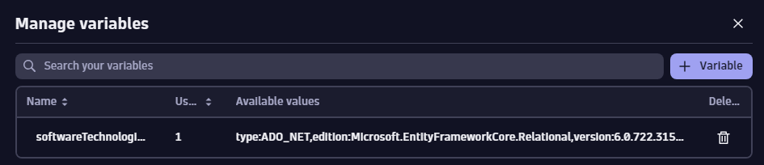
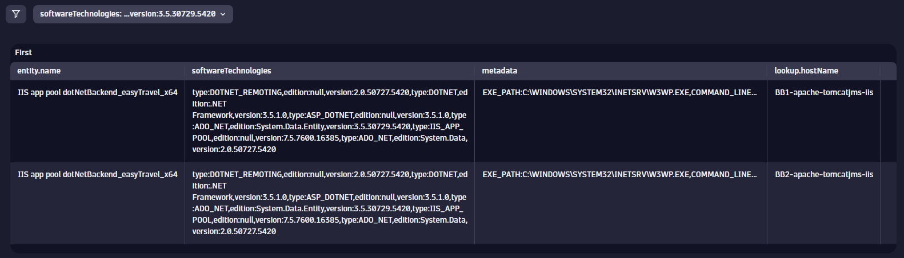
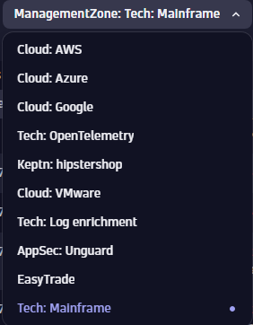
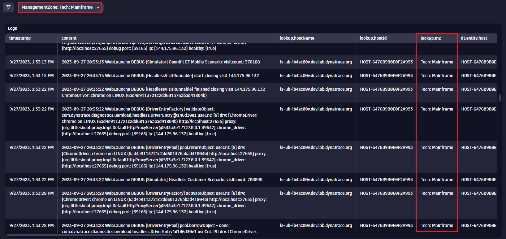

## Additional Exercises

In this section, you will find additional exercises to practice and test your abilities querying logs.

### Exercise 1 - Logs

All log records will have a status field. This is commonly "INFO", "WARN", "ERROR", etc.. Build a DQL query that calculates the percentage of ERROR records vs the total number of records.

HINT: No filters are required, use the countIf() and toDouble() functions. Be sure to create variables to refence. Use FieldsAdd to produce the percentage.

<H4><details>
<summary>Solution</summary>

```
fetch logs
| summarize total = count(), errorTotal = countif(status == "ERROR")
| fieldsAdd errorPercent = toDouble(errorTotal) / toDouble(total) * 100
```

</details></H4>
<br>
<br>

### Exercise 2 - Entities

In the [HOT session environment](https://zcy16892.apps.dynatrace.com/), pick one host and fetch a list of all the process groups running on that host that contain "easytravel" in their name. There may be more than one possible solution.

HINT: Try to solve this exercise using the **Expand** command mentioned at the end of the previous entity exercises.

<H4><details>
<summary>Possible Solution</summary>

```
fetch dt.entity.host
| filter entity.name == "ip-10-0-0-219.ec2.internal"
| fieldsAdd runs[dt.entity.process_group], alias:process_group_id
| expand process_group_id
| lookup sourceField:process_group_id, lookupField:id, [fetch dt.entity.process_group]
| fieldsRemove lookup.id
| filter contains(lookup.entity.name, "easytravel")
```

</details></H4>
<br>
<br>


### Exercise 3 - Timeseries

Starting with the following query:

```
timeseries {
usage = avg(dt.host.cpu.usage),
system = avg(dt.host.cpu.system)
},
by:{dt.entity.host}
```

Add the ability to show the correct host names instead of the DT entity IDs shown by default. Use the lookup and fieldsRemove commands.

<H4><details>
<summary>Possible Solution</summary>

```
timeseries {
usage = avg(dt.host.cpu.usage),
system = avg(dt.host.cpu.system)
},
by:{dt.entity.host}
| lookup [fetch dt.entity.host], sourceField:dt.entity.host, lookupField:id
| fieldsRemove dt.entity.host, lookup.id
```

</details></H4>
<br>
<br>


## Hands-On Exercise 5 - Challenge Exercises

In this section, you will find additional exercises to practice and test your abilities querying logs, entities, metrics, and business events in DQL.

## Exercise 1: Process groups by technology

Even though the entity example is very useful, it is not dynamic as we are hardcoding the technology we are looking for into our query. Wouldn’t it be way better to have a refined list of technologies discovered in our environment and select the one we are interested at instead of having to manually hardcode it? 

We can take this example one step further. Using dashboards, some creative queries and variables, we can have the same view with the difference that it can now be dynamically filtered based on the selected discovered technology.

### Step 1: Define a variable to discover technologies
Using a DQL query, look for the detected software technologies based on PGI metadata.



(**Hint**: There are several ways of achieving this. There might be situations where the resulting dataset returns more than 1,000 results which is a limitation for a dashboard variable. Using functions like **collectDistinct** we can make sure we return as many individual meaningful entries as possible.)

<H4><details>
<summary>Click to Expand Solution</summary>
<br>

```
fetch dt.entity.process_group_instance
| expand softwareTechnologies
| filter isNotNull(softwareTechnologies)
| summarize temp = collectDistinct(softwareTechnologies)
| expand techVersion = temp
| sort techVersion asc
| fieldsRemove temp
```
</details></H4>
---

### Step 2: Adapt the previous example to use the variable 
Using the previous entity information example as a starting point, use the variable to be able to set the technology dynamically based on the value selection.



(**Hint**: [Here](https://www.dynatrace.com/support/help/observe-and-explore/dashboards-new/components/dashboard-component-data#add-data) you can find the documentation on how to reference variables in your code.

<H4><details>
<summary>Click to Expand Solution</summary>
<br>

```
fetch dt.entity.process_group_instance
| filter contains(toString(softwareTechnologies), $softwareTechnologies)
| fields entity.name, softwareTechnologies, belongs_to, metadata
| fieldsAdd belongs_string = toString(belongs_to)
| fieldsAdd host = substring(belongs_string, from:indexOf(belongs_string, ":")+2, to:lastIndexOf(belongs_string, "\""))
| lookup [fetch dt.entity.host 
| fields hostName=entity.name, hostId=id ], sourceField:host, lookupField:hostId
| fieldsRemove belongs_to, lookup.hostId, host, belongs_string
| sort entity.name asc
| sort lookup.hostName
```
</details></H4>
---

### Exercise 2: Logs by management zone
We know that management zones are going away, and because of that there is no built-in way of implementing a filter for management zones. Still, based on what we have seen, having access to both log and entity data and commands like the lookup we should be able to filter (though limited) at management zone level right?

Think about it. We know how to access logs, we know how to filter these log entries, we know how to access entity level data, the only thing we need to do now is to combine all of these concepts into a single dashboard.

### Step 1: Define a variable to discover management zones
In this case, we will reference host level data to retrieve the list of available management zones. In a dashboard, lets define a query type of variable so we can use DQL to access the list of available management zones in the environment.



(**Hint**: Remember using commands like describe to understand what kind of data is avaiable for host entities..)

<H4><details>
<summary>Click to Expand Solution</summary>
<br>

```
fetch dt.entity.host
| summarize temp = collectDistinct(managementZones)
| expand MZ = temp
| fields MZ
```
</details></H4>

---
### Step 2: Use the defined variable to fetch logs
At this point we have a way to dynamically extract all the management zones read from hosts. Now we just need to use this information to limit the scope of our log fetching. If you fetch logs, you will note that there is no field that references the concept of a management zone anywhere, so how are we going to achieve the filtering?
Using a lookup command, we can run a second query fetching for host entity data, and in this query is where we do the filtering based on management zones. Basically what we are asking for is a list of hosts IDs that belong to a particular management zone, and using this list of IDs we are requesting log entries for such hosts.



<H4><details>
<summary>Click to Expand Solution</summary>
<br>

```
fetch logs
| lookup [fetch dt.entity.host 
	| filter in(managementZones, $ManagementZone) 
    | fields hostName=entity.name, hostId=id, mz=managementZones], sourceField:host.name, lookupField:hostName
| filter isNotNull(lookup.hostName)
```
</details></H4>
